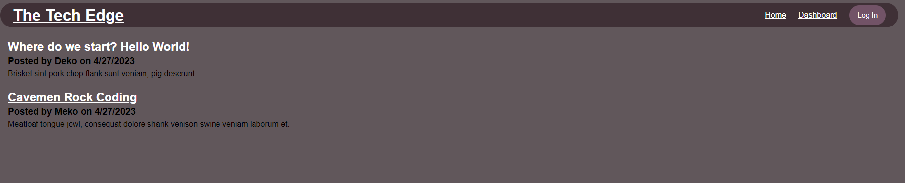
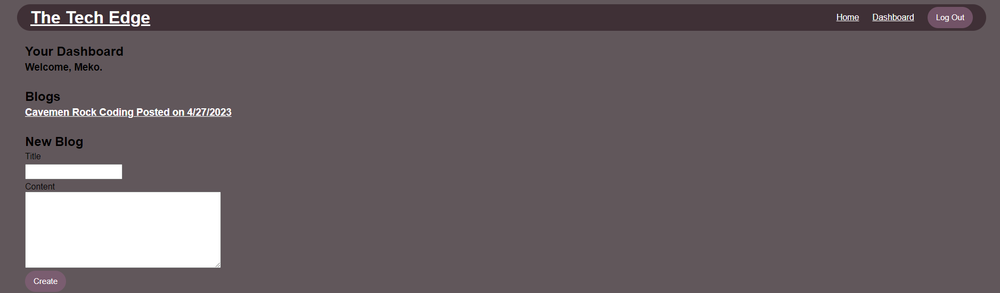

# The-Tech-Edge

## About
This is a tech blog website built using the Model-View-Controller (MVC) architectural pattern. This pattern separates the application into three interconnected parts: the model, the view, and the controller.

The model represents the data and the business logic of the application. In this tech blog, the model handles the database interactions, such as creating, reading, updating, and deleting blog posts and user data.

The view is responsible for rendering the user interface, which in this tech blog includes the different pages such as the homepage, individual blog post pages, and user authentication pages.

The controller acts as the intermediary between the model and the view. It receives user input from the view and interacts with the model to update the data accordingly. The controller then sends the updated data to the view for rendering.

## Website Showcase
### Deployed Application
[The Tech Edge](https://thetechedge-f506d3011f09.herokuapp.com/)
### Screenshots
Homepage

Logged in dashboard

## Tehnologies Used
- HTML
- CSS
- JS
- Node.js
- Express.js
- MySQL
- Sequalize
- Handlebars
- Express-Session

